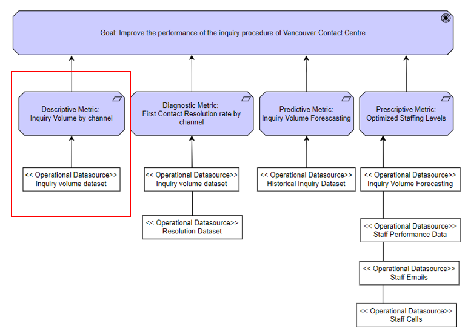
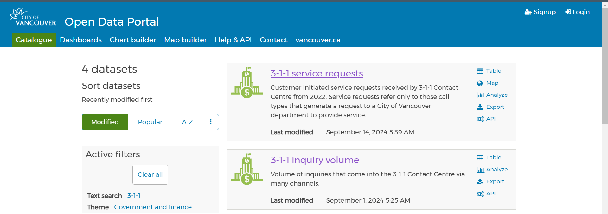
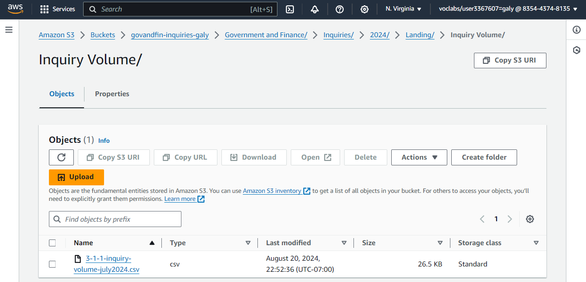
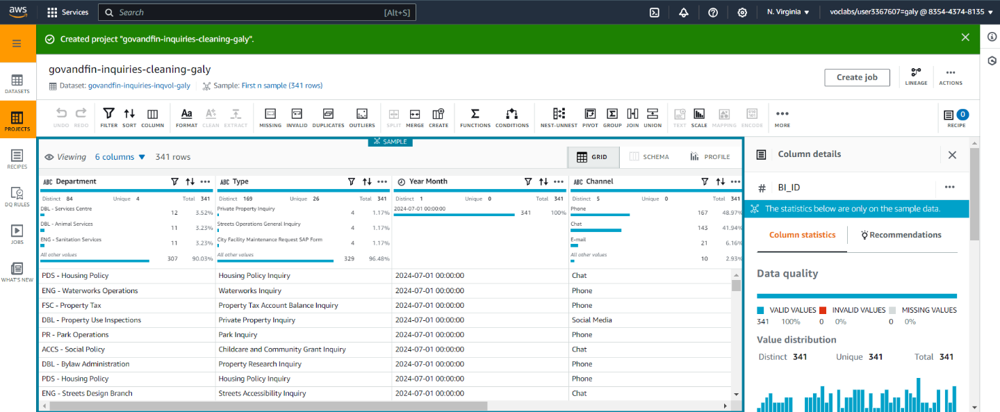
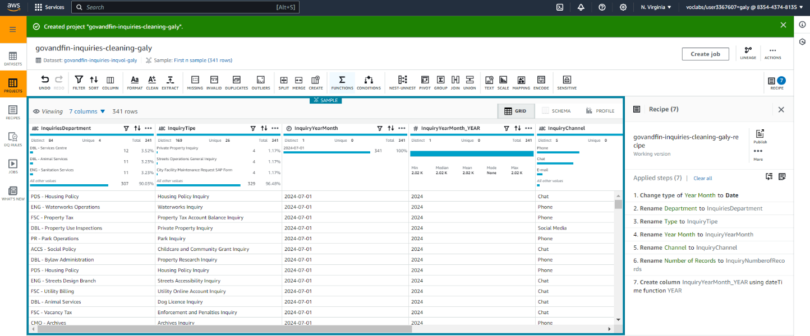
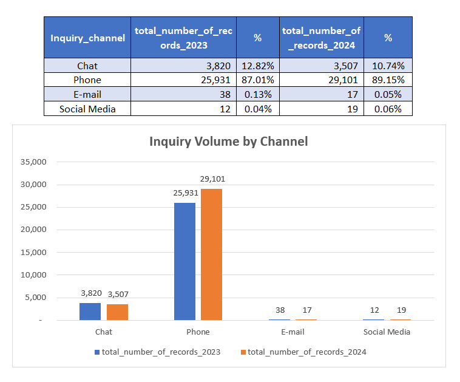

# Understanding Inquiry Volume at the City of Vancouver
## Objective:
The primary goal of this project is to conduct a descriptive analysis of the inquiries from the 3-1-1 Contact Centre, which belongs to the City of Vancouver, aiming to generate insights that can assist the organization in making effective decision-making.
## Background:
The 3-1-1 Contact Centre in the City of Vancouver receives many inquiries monthly from different channels. Each inquiry is classified according to the department related to it, such as “DBL - Electrical Inspections." Likewise, besides the department, the type of inquiry (e.g., equity diversity and inclusion inquiry) is also considered as the channel through which the inquiry is received. 
## Dataset:
The dataset includes the volume of inquiries from the 3-1-1 Contact Centre from the City of Vancouver for July 2024 and July 2023, containing the following key features:
* Department: Name of the organization unit in the City of Vancouver.
* Type: Type of Inquiry
* Year Month: Year and month that the inquiry was received.
* Channel: How the inquiry or request came to the 3-1-1 Contact Centre (e.g., phone).
* Number of Records: number of records
* BI_ID: Unique identifier for each department, type, date, and channel (e.g., for the ACCS - Civic Theatres Department, performance inquiry type, for the date of Jul-23 and by phone, the BI_ID is 17589).
## Methodology:
#### 1. Data Analytical Question Formulation
* A descriptive metric was developed to analyze the performance of the 3-1-1 Contact Centre about inquiries.
* Descriptive Metric: Inquiry Volume by channel
  * Description: This metric will track the number of inquiries received by the Contact Centre across different channels (phone, email, chat, social media, etc.) over a specific period.
  * Operational Datasets: Inquiry Volume Dataset.

#### 2. Data Collection
*	The inquiry volume dataset is located in the City of Vancouver Portal (opendata.vancouver.ca/pages/home) within the theme of Government and Finance.

* The place for storage of the datasets will be inside a bucket created in the Cloud with the assistance of the service S3 of AWS. The design for the data storage is shown in the following figure:

* Three types of folders have been created. “Landing,” where the operational datasets will be stored; “Raw,” for the storage of the cleaned and structured datasets; and "Curated," for the storage of the metric dataset and the analyzed data queries.
* Then we do the data ingestion, loading the datasets in their respective folder and their corresponding year:

#### 3. Data Pipeline Design:
* A data lineage diagram was built to go from the operational datasets to reach an analytical dataset for each year that contains the descriptive metric and ensures that the data is high quality, has structure, and is summarized.
 

#### 4. Data Preparation:
* Using AWS Glue Data Brew to perform the data cleaning to address missing values, and remove duplicates.

*	Using AWS Glue Data Brew to perform data type conversions to ensure that all fields are in suitable formats for analysis and derive new features that may aid in analytics, such as separate year for the Year Month column.

#### 5. Data Pipeline Implementation:
* Using AWS Glue to build and deploy the designed data pipeline.

#### 6. Data Visualization:
* With the resulting dataset, we can create a visual representation of the findings:

#### 7. Insights and Findings:
* From the visualization, the channel most used by citizens in the city of Vancouver to make inquiries is the phone, with 25,931 inquiries in 2023 and 29,101 in 2024, with 87.01% and 89.15%, respectively.
* The next channel most used is the chat, with 3,820 in 2023 and 3,507 in 2024. These inquiries represent 12.82% and 10.71%, respectively.
* Email and social media are the least used channels by citizens. The inquiries from email were only 38 in 2023, representing 0.13% of the total. This amount decreased in 2024, with 17 inquiries representing 0.05% of the total. Regarding social media, in 2023, there were 12 inquiries through this channel, which was 0.04% of the total. In 2024, the amount increased slightly, representing 0.06% of the total.
#### 8. Recommendations:
* Based on the findings, it is recommended to evaluate the reasons because the citizens prefer mostly phone over the other channels (time of response, accuracy, etc.)
* Whether after the evaluation, all channels provide the same functionalities, such as quick response time, considering the elimination of the least used channel or further channel boost.

